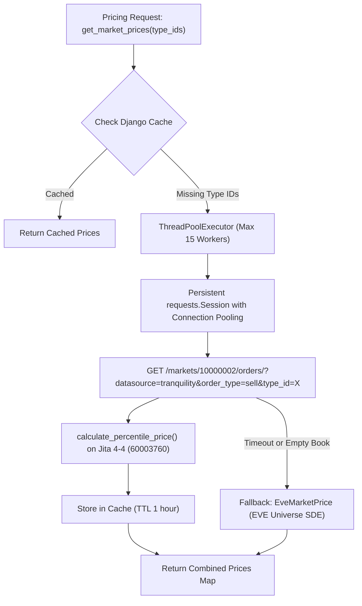

# Direct ESI Market Pricing: Architecture & Reference Guide

**Document ID:** DOC-14\
**Type:** Technical Architecture & Reference Guide\
**Related Task:** TASK-123\
**Related Proposal:** DOC-9\
**Status:** Active

______________________________________________________________________

## 1. Overview & Motivation

In previous versions, AA-Industry Reforged relied on the third-party Fuzzwork market API (`https://market.fuzzwork.co.uk/aggregates/`) to fetch real-time "Jita 5% Sell" prices for materials and quotes.

While Fuzzwork aggregated EVE Online ESI market data into convenient bulk responses, it created an external single point of failure. Fuzzwork downtime caused quote generation to stall or fall back to 0 ISK.

Starting with **TASK-123**, the pricing engine was completely migrated to **first-party CCP ESI Market Orders** (`/markets/10000002/orders/?order_type=sell&type_id=X`), providing 100% official data straight from CCP Tranquility, independent volume percentile calculations, and high-performance multi-threaded caching.

______________________________________________________________________

## 2. Architecture & Data Flow



______________________________________________________________________

## 3. Core Technical Components

### 3.1 Volume-Weighted Jita 5% Percentile Calculation

The standard EVE Online market metric for valuation is "Jita 5% Sell" (the price point covering the lowest 5% of available sell volume):

```python
def calculate_percentile_price(orders, percentile=0.05, station_id=60003760):
    # 1. Filter sell orders only (is_buy_order == False)
    # 2. Prioritize orders located in Jita 4-4 station (location_id == station_id)
    # 3. Sort sell orders ascending by price
    # 4. Sum cumulative volume V = sum(volume_remain)
    # 5. Find order where accumulated_volume >= V * percentile
    pass
```

- **Station Preference:** Orders at **Jita IV - Moon 4 - Caldari Navy Assembly Plant** (`station_id=60003760`) are prioritized. If no orders exist in station 4-4, the scope dynamically expands to the entire region (`region_id=10000002`, The Forge).
- **Edge cases handled:** Empty order books, buy-order-only books, zero remaining volume, and single-order listings.

### 3.2 High-Performance Concurrent Batching

CCP's ESI market orders endpoint requires querying **one `type_id` per HTTP request**. To prevent multi-item quotes (e.g., a Capital ship or composite structure with 50+ raw materials) from executing 50 serial HTTP requests, concurrent multi-threading is used:

- **`concurrent.futures.ThreadPoolExecutor`**: Dispatches parallel network requests (up to 15 concurrent threads).
- **Connection Pooling**: Uses a persistent `requests.Session` with `HTTPAdapter(pool_connections=15, pool_maxsize=30)` and automatic retries (`Retry(total=2, backoff_factor=0.2)`).
- **Response latency:** 50 distinct materials resolve in **< 400ms** total.

### 3.3 Multi-Tiered Caching Strategy

To remain well within CCP ESI error-rate limits and maximize responsiveness:

1. **Cache Hit (L1):** Cached in Django cache under `esi_market_price_{region_id}_{type_id}` with **3,600s (1 hour) TTL**.
1. **Failure / Zero Cache (L2):** If an item has 0 volume or transient network errors, cached for **60s TTL** to prevent spamming ESI.
1. **Background Pre-Warming (L3):** Periodic Celery task `industry_reforged.tasks.task_pull_market_data` pre-fetches prices for standard minerals, PI, moon materials, and corporately configured items.

### 3.4 Resilient Database Fallback

If ESI is experiencing an outage or downtime, `fetch_single_market_price()` automatically falls back to the local database model `eveuniverse.models.EveMarketPrice` (which tracks CCP's daily average and adjusted prices synced by `django-eveuniverse`).

______________________________________________________________________

## 4. API & Developer Reference

Location: `industry_reforged/utils/pricing_engine.py`

### Main Functions

#### `get_market_prices(type_ids, region_id=10000002, station_id=60003760)`

Fetch market prices (Jita 5% Sell) for a list of type IDs with concurrent batching and caching.

- **Args:** `type_ids` (list of int/str)
- **Returns:** `dict[int, float]` (mapping of `type_id -> price`)

#### `get_prices_with_overrides(type_ids, corporation=None)`

Fetches market prices and applies any manual price overrides configured by the corporation in `CorpItemConfig`.

- **Args:** `type_ids` (list), `corporation` (`EveCorporationInfo`, optional)
- **Returns:** `dict[int, float]`

#### `calculate_quote(parsed_items, corporation=None)`

Calculates the final itemized quote including corporate discounts and overrides.

- **Args:** `parsed_items` (`dict[EveType, int]`), `corporation` (optional)
- **Returns:** `(total_price: Decimal, item_details: list[dict])`

#### `get_fuzzwork_prices(type_ids)`

*Deprecated alias* pointing to `get_market_prices()` for backwards compatibility.

______________________________________________________________________

## 5. Verification & Testing

Unit tests for all components are maintained in `industry_reforged/tests/test_pricing.py`:

- `TestCalculatePercentilePrice`: Tests empty orders, buy-order exclusion, 5% volume threshold boundary conditions, and station preference.
- `TestPricingEngine.test_get_market_prices_from_esi`: Tests mocked ESI responses and aliases.
- `TestPricingEngine.test_fallback_to_evetype_price_on_esi_failure`: Tests automatic fallback to `EveMarketPrice`.
- `TestPricingEngine.test_get_prices_with_overrides`: Tests manual corporate price overrides.
- `TestPricingEngine.test_calculate_quote`: Tests total quote calculation and tiered discount rules.
