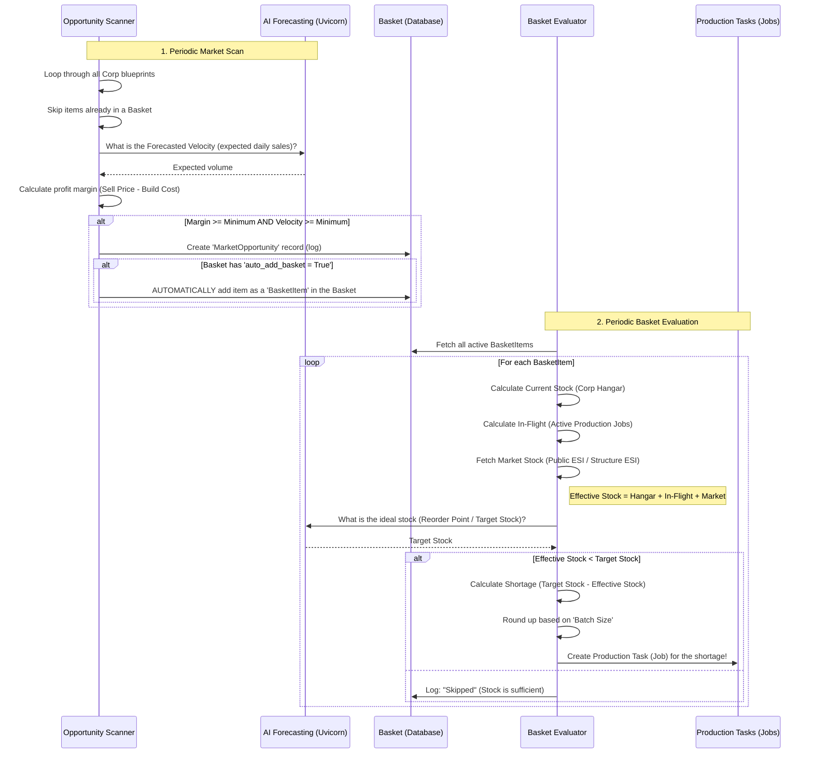

# AI Market Manager Workflow

The AI Market Manager module in Alliance Auth Industry (Reforged) is built from two separate processes. To clarify the decision moments, you can find a diagram and explanation of the process below.

## Decision Diagram (Sequence)

## How do Opportunities and Baskets relate?

1. **Market Opportunity:** This is a *suggestion*. It tells you: "Hey, Vargurs are very profitable in this hub right now."
2. **Basket:** This is your *intention to build*. You can manually add items to a basket (BasketItems). If you enable the `auto_add_basket` (Auto-Approve Opportunities) setting on a Basket, the Scanner will automatically add profitable items as BasketItems to that Basket.
3. **Jobs (Production Tasks):** These are **only** created by the *Basket Evaluator*. It looks purely at what is in the Baskets. An Opportunity will therefore never create a Job directly; it must always become a BasketItem first (manually or automatically).
