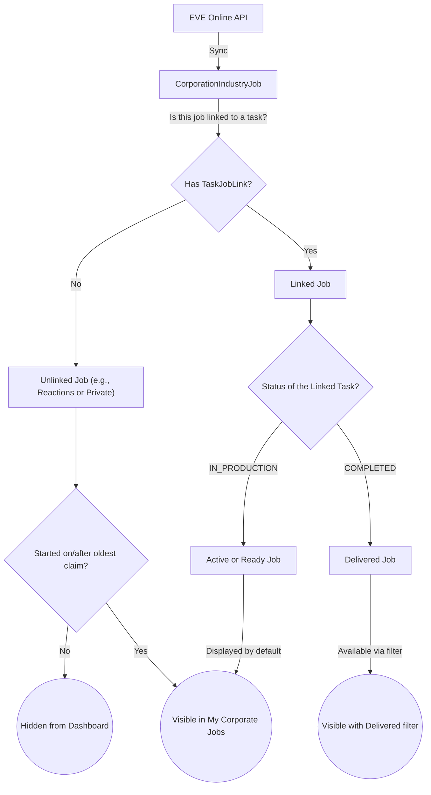

# Job Filtering Logic

This document describes the logic behind selecting and displaying EVE jobs (industry jobs from the game) based on locally claimed tasks (`ProductionTask`) in the Industrialist Dashboard, as implemented in recent versions (v0.3.12+).

## Concept & Data Model

Within the application, we deal with three main components:

1. **ProductionTask**: This is a claimed task within Alliance Auth. It specifies what needs to be built and who is going to build it. A task can have statuses such as `IN_PRODUCTION` (active) or `COMPLETED` (finished).
1. **IndustryJob** (`CorporationIndustryJob` / `CharacterIndustryJob`): These are the actual jobs as they are running in EVE Online, fetched via the API.
1. **TaskJobLink**: This table acts as the bridge between a `ProductionTask` and one or more `IndustryJob`s.

## How the Selection Works

Previously, the **"Corporate Jobs Overview"** and **"My Corporate Jobs"** tabs displayed *all* active EVE jobs, regardless of whether the user started them privately in-game or claimed them via the app. This led to a cluttered dashboard with unrelated personal jobs.

Since v0.3.12 and subsequent updates, the logic works as follows:

- **Strict Relation Check for Corp Jobs Overview**: The Corporate Dashboard tab filters jobs using `taskjoblink__isnull=False`. This means an EVE job is **only** retrieved if it is successfully linked to a `ProductionTask` via a `TaskJobLink`.
- **Time Window for My Corporate Jobs**: The Industrialist Dashboard uses a more flexible time window approach to support unlinked jobs like Reactions. It calculates the `oldest_claim_date` based on the user's currently active claims (`IN_PRODUCTION` status).
- **Visibility of Unlinked Jobs**: Jobs started by the user in EVE without a corresponding claimed task (e.g. Reactions) are shown **only if** their `start_date` falls on or after the `oldest_claim_date`. If the user has no active claims, unlinked jobs are hidden.
- **Preservation of History**: Jobs with a valid link (`taskjoblink__isnull=False`) are always shown regardless of the time window. This ensures that users can still view their historical claimed tasks by setting the UI filter to "Delivered" or "All".

## Diagram: Data Flow and Visibility

The diagram below outlines how a job originating from EVE is processed and whether it ends up visible on the dashboard.

## Conclusion

By employing a hybrid filtering approach, we ensure the dashboard displays exactly what the user expects:

1. Jobs explicitly linked to tasks (`taskjoblink__isnull=False`) are always retained for history.
1. Unlinked jobs (such as EVE Reactions) are visible dynamically, but only if they were started during an active work session (measured from the oldest active claim date).
   This prevents old private jobs from cluttering the interface while fully supporting complex production chains that include unlinked steps.
