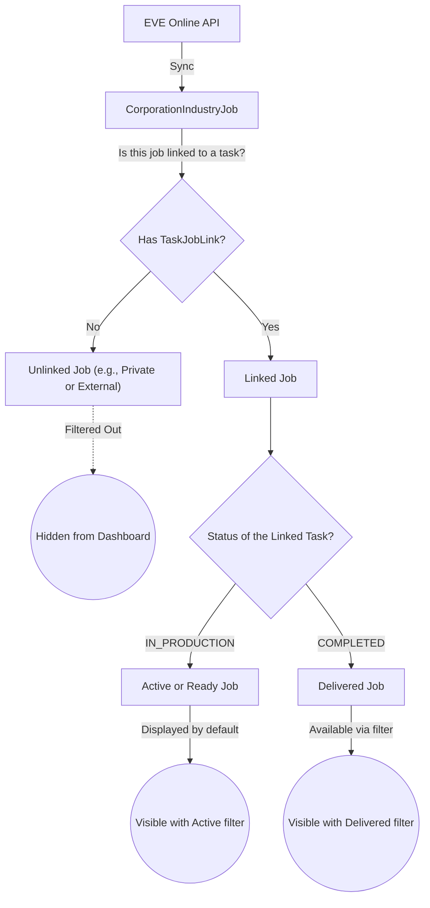

# Job Filtering Logic

This document describes the logic behind selecting and displaying EVE jobs (industry jobs from the game) based on locally claimed tasks (`ProductionTask`) in the Industrialist Dashboard, as implemented in version v0.3.12.

## Concept & Data Model

Within the application, we deal with three main components:

1. **ProductionTask**: This is a claimed task within Alliance Auth. It specifies what needs to be built and who is going to build it. A task can have statuses such as `IN_PRODUCTION` (active) or `COMPLETED` (finished).
1. **IndustryJob** (`CorporationIndustryJob` / `CharacterIndustryJob`): These are the actual jobs as they are running in EVE Online, fetched via the API.
1. **TaskJobLink**: This table acts as the bridge between a `ProductionTask` and one or more `IndustryJob`s.

## How the Selection Works

Previously, the **"Corporate Jobs Overview"** and **"My Corporate Jobs"** tabs displayed *all* active EVE jobs, regardless of whether the user started them privately in-game or claimed them via the app. This led to a cluttered dashboard with unrelated personal jobs.

Since v0.3.12, the logic works as follows:

- **Strict Relation Check**: The database query filters jobs using `taskjoblink__isnull=False`. This means an EVE job is **only** retrieved if it is successfully linked to a `ProductionTask` via a `TaskJobLink`.
- **Exclusion of Private Jobs**: Jobs started by the user in EVE without a corresponding claimed task in the app have no link and are thus immediately filtered out.
- **Preservation of History**: Because we only check if the link exists (and do not strictly require the task to be `IN_PRODUCTION`), jobs from already finished (`COMPLETED`) tasks remain in the dataset. This ensures that users can still view their historical claimed tasks by setting the UI filter to "Delivered" or "All".

## Diagram: Data Flow and Visibility

The diagram below outlines how a job originating from EVE is processed and whether it ends up visible on the dashboard.

## Conclusion

By restricting the database query to exclusively fetch EVE jobs with a valid `TaskJobLink` (`taskjoblink__isnull=False`), we ensure the dashboard displays exactly what the user expects: only jobs that originate from tasks claimed within the application, while retaining the ability to search for and view finished/delivered jobs.
